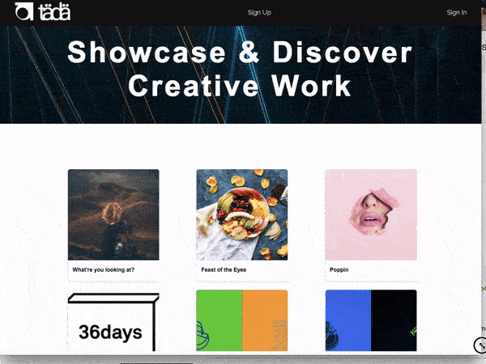
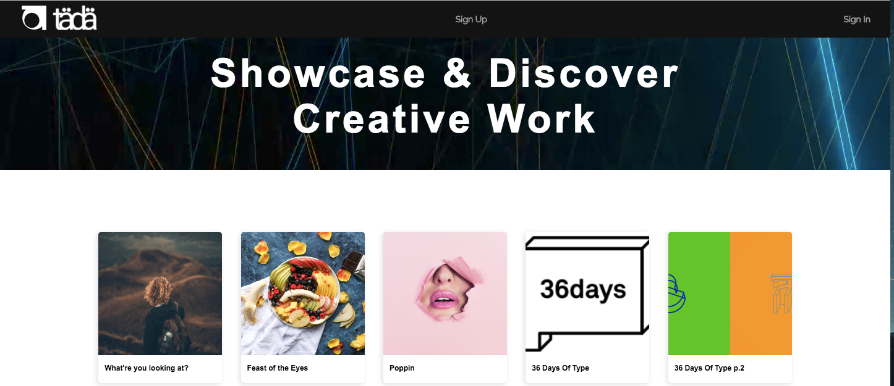
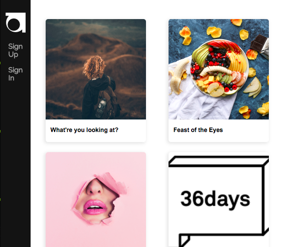
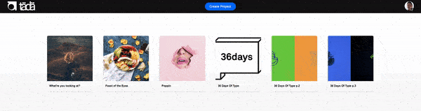

# Tada 

[Tada Live][heroku]

[heroku][heroku]

[heroku]: http://tada-application.herokuapp.com

Tada is a fullstack web application inspired by Behance. It's built using Ruby on Rails as a backend framework, a PostgreSQL DB, and React.js using Redux on the frontend.


# Features & Implementation

## Responsive design




## Comment and star projects


```javscript
toggleLike(e) {
    e.preventDefault();
    e.stopPropagation();
    const { currentUser } = this.props.state;
    if (!currentUser.id || this.project.user_id === currentUser.id) {
      return;
    } else if (this.project.likes.includes(currentUser.id)) {
      this.unlike(this.project.id);
    } else {
      this.like(this.project.id);
    }
  }
```

# Future Direction
- [ ] Connect through messages
- [ ] Project Creation/project editor
- [ ] Tags and Galleries
- [ ] Comment editing/deletion